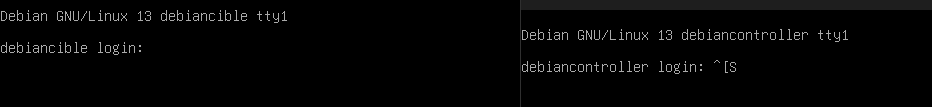
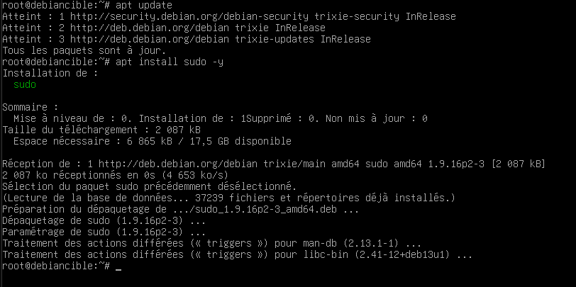
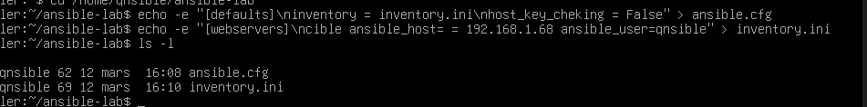
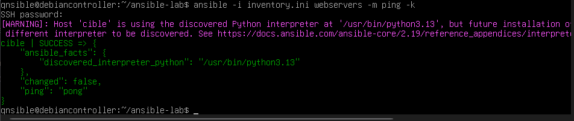
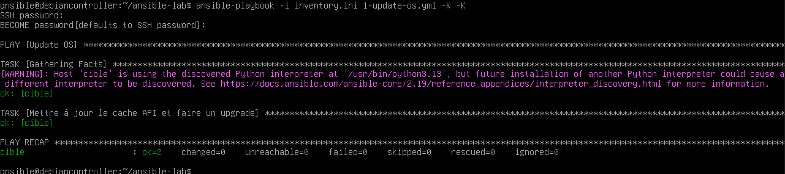
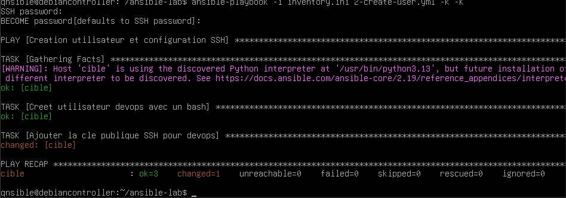
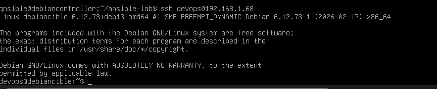
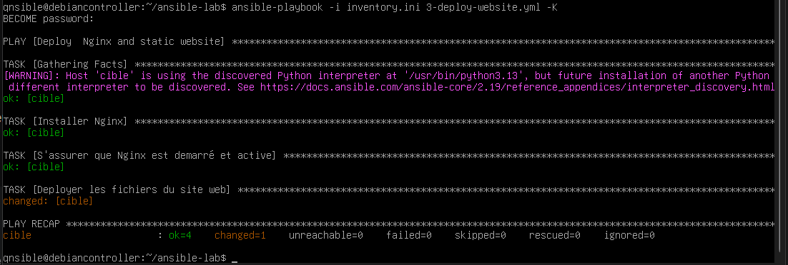
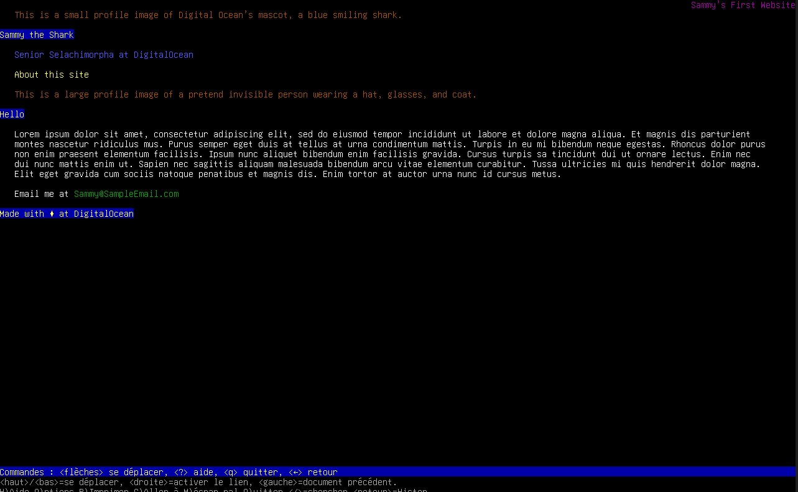
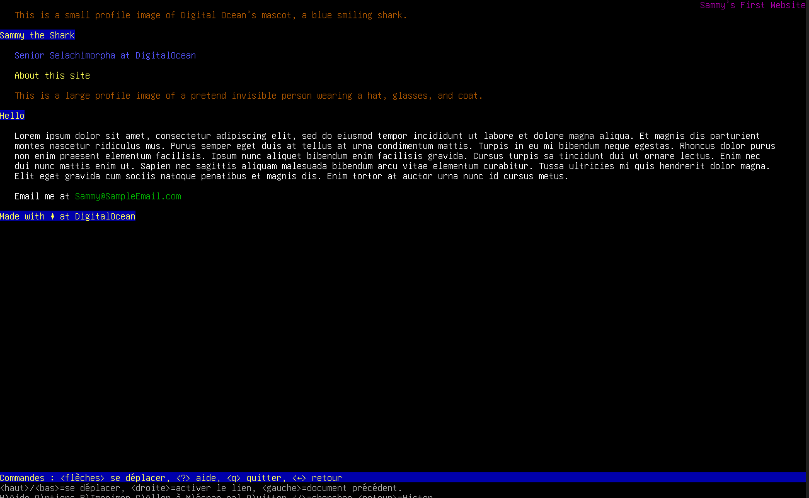

# Projet Ansible - Administration centralisée et sécurisée
Elif JAFFRES
## Table des matières

- [Projet Ansible - Administration centralisée et sécurisée](#projet-ansible---administration-centralisée-et-sécurisée)
  - [Table des matières](#table-des-matières)
  - [Présentation de la solution (Ansible)](#présentation-de-la-solution-ansible)
  - [Concepts Fondamentaux de l'écosystème Ansible](#concepts-fondamentaux-de-lécosystème-ansible)
  - [Périmètre du livrable](#périmètre-du-livrable)
  - [Le "Challenge" Debian : Gestion des droits](#le-challenge-debian--gestion-des-droits)
    - [Pourquoi ce choix ? La différence entre Debian et Ubuntu](#pourquoi-ce-choix--la-différence-entre-debian-et-ubuntu)
  - [Objectifs du TP](#objectifs-du-tp)
  - [Architecture](#architecture)
  - [Étapes de réalisation](#étapes-de-réalisation)
    - [Étape 0 : Préparation des Machines Virtuelles](#étape-0--préparation-des-machines-virtuelles)
    - [Étape 1 : Déploiement du nœud de contrôle et environnement](#étape-1--déploiement-du-nœud-de-contrôle-et-environnement)
    - [Étape 2 : Configuration locale et Inventaire](#étape-2--configuration-locale-et-inventaire)
    - [Validation de l'environnement (Test de connectivité)](#validation-de-lenvironnement-test-de-connectivité)
    - [Étape 3 : Durcissement du système (Premier Playbook)](#étape-3--durcissement-du-système-premier-playbook)
    - [Étape 4 : Sécurisation (Utilisateur `devops` et Clés SSH)](#étape-4--sécurisation-utilisateur-devops-et-clés-ssh)
    - [Transition vers l'accès "Sans Mot de Passe"](#transition-vers-laccès-sans-mot-de-passe)
    - [Étape 5 : Déploiement de NGINX + site démo](#étape-5--déploiement-de-nginx--site-démo)
    - [Étape 6 : Validation finale du site web](#étape-6--validation-finale-du-site-web)
      - [A. Visualisation via navigateur (Windows)](#a-visualisation-via-navigateur-windows)
      - [B. Visualisation via terminal (Controller)](#b-visualisation-via-terminal-controller)
  - [Conclusion](#conclusion)

## Présentation Projet Ansible

Dans un contexte d'infrastructure à grande échelle, la gestion manuelle des serveurs (mises à jour, configuration de services, gestion des utilisateurs) s'avère chronophage et propice aux erreurs humaines.

**Ansible**, solution open-source de gestion de configuration et d'automatisation développée par Red Hat, répond à ces problématiques. Son architecture repose sur trois piliers majeurs :
1. **L'Infrastructure as Code (IaC)** : Les configurations sont définies via des Playbooks (écrits en YAML), garantissant la reproductibilité et l'idempotence des déploiements.
2. **Un modèle d'inventaire clair** : Les hôtes cibles sont regroupés de manière logique au sein de fichiers d'inventaire.
3. **Une approche « Agentless »** : Contrairement à d'autres solutions, Ansible ne nécessite l'installation d'aucun agent sur les machines cibles. La communication s'effectue de manière chiffrée via le protocole **SSH** standard depuis un nœud central (le **Controller**).

## Concepts Fondamentaux de l'écosystème Ansible

Pour bien appréhender la documentation technique de ce dépôt, voici le socle terminologique inhérent à Ansible :

*   **Control Node (Nœud de contrôle)** : La machine depuis laquelle les opérations sont orchestrées et exécutées. Ansible y est installé et exécute les scripts vers les cibles.
*   **Managed Node (Nœud géré / Cible)** : L'entité (serveur, équipement réseau, VM) devant être configurée ou administrée. Aucun agent logiciel Ansible n'y est requis.
*   **Playbook** : Le fichier source principal de l'automatisation (l'équivalent d'un plan d'exécution ou d'un script). Il consigne une série de tâches à exécuter séquentiellement sur un ou plusieurs groupes d'hôtes pour atteindre un état désiré (Idempotence).
*   **YAML (YAML Ain't Markup Language)** : Le format de sérialisation de données - lisible par l'humain - utilisé pour rédiger les Playbooks et les configurations d'Ansible. Son extension est usuellement `.yml`.
*   **Module** : L'unité de code exécutée par Ansible. Il en existe des milliers (ex: le module `apt` pour gérer des paquets Debian, le module `user` pour l'authentification). Les Playbooks appellent ces modules.
*   **Inventory (Inventaire)** : Fichier (typé `.ini` ou `.yml`) cartographiant statiquement ou dynamiquement les nœuds gérés (Adresses IP ou FQDN) et permettant de les scinder en groupes logiques (ex: *[webservers]*, *[databases]*).
*   **Nginx ** : Bien que n'étant pas exclusif à Ansible, il s'agit du logiciel Serveur Web (et Reverse Proxy). Dans ce projet, il représente le service final ou l'application "métier" que nous cherchons à déployer automatiquement sur la Cible pour valider notre architecture IaC.

## Périmètre du livrable

L'objectif de ce projet est de concevoir, implémenter et valider une architecture d'administration centralisée reposant sur un nœud de contrôle Ansible (Controller) et un nœud cible (Serveur Web). La démarche vise à accomplir trois missions principales de manière entièrement automatisée, traduites par trois Playbooks distincts :

1. **`1-update-os.yml`** : Implémentation d'un playbook garantissant l'application systématique et centralisée des correctifs de sécurité sur l'OS cible.
2. **`2-create-user.yml`** : Création et configuration automatisée d'un utilisateur système avec privilèges sur les machines cibles.
3. **`3-deploy-website.yml`** : Installation reproductible du serveur Nginx et déploiement d'une page statique (`index.html`) personnalisée depuis le Controller.

## Le "Challenge" Debian : Gestion des droits

Bien que le TP original préconise l'utilisation d'Ubuntu, **nous avons choisi de réaliser ce projet sous Debian** pour ajouter une dimension technique intéressante concernant la gestion des droits utilisateurs sous Linux.

### Pourquoi ce choix ? La différence entre Debian et Ubuntu

Sous Linux, pour effectuer des tâches d'administration (comme installer un logiciel ou modifier la configuration système avec Ansible), il faut posséder les privilèges du super-utilisateur, appelé **`root`**. Cependant, se connecter directement à distance via SSH en tant que `root` est une faille de sécurité majeure. Il faut donc se connecter avec un utilisateur "standard", mais lui donner temporairement les pleins pouvoirs.

* **L'approche Ubuntu (la plus simple)** : Par défaut, le compte `root` direct est désactivé. Lors de l'installation, on crée un utilisateur standard (ex: `elif`). Ubuntu va automatiquement configurer cet utilisateur pour qu'il puisse utiliser la commande `sudo` (Super-User DO). Cet utilisateur peut donc administrer la machine en tapant *son propre mot de passe*. Ansible gère cela nativement.
* **L'approche Debian (le challenge)** : Historiquement, l'installateur Debian demande de créer un vrai mot de passe pour le compte `root` direct, puis de créer un utilisateur standard à part. Le problème est que cet utilisateur standard n'a absolument **aucun droit** d'administration par défaut et n'est pas configuré pour utiliser `sudo`. 

Pour qu'Ansible puisse se connecter en SSH avec un simple utilisateur et avoir les droits pour configurer la Cible, **il faut obligatoirement configurer Debian pour qu'il se comporte comme Ubuntu**. C'est ce que nous ferons lors de la préparation des machines.

---

## Objectifs du TP

1. **Préparation de l'outillage** : Déployer un nœud de contrôle Ansible (Debian).
2. **Durcissement du système** : Développer un playbook pour forcer la mise à jour complète de l'OS cible.
3. **Sécurisation des accès** : Déployer des clés SSH et limiter l'usage des mots de passe.
4. **Déploiement standardisé** : Installer et configurer Nginx de façon reproductible.
5. **Validation** : Tester les connexions et le bon fonctionnement de Nginx.

## Architecture

* **Controller** : Machine virtuelle gérant les configurations Ansible (sous Debian).
* **Cible (Serveur Web)** : Machine virtuelle cible de nos déploiements (sous Debian).

## Étapes de réalisation

Ce dépôt documentera pas à pas toutes les actions entreprises.

### Étape 0 : Préparation des Machines Virtuelles

Voici les étapes clés lors de l'installation et de la configuration des  VMs Debian pour relever le défi des droits évoqué plus haut :

1. **Installation de Debian** :
   * Lors de l'installation, définissez un **mot de passe pour le compte `root`** (c'est le comportement classique de Debian que nous voulons affronter).
   * Ensuite, créez votre utilisateur standard (ex: `elif`) avec son propre mot de passe.
   * N'oubliez pas de cocher l'installation du **serveur SSH** à la fin de l'installation.

    

2. **Configuration Réseau (VirtualBox)** :
   * Une fois la VM créée, allez dans ses paramètres réseau.
   * Changez le mode d'accès de "NAT" vers **"Accès par pont" (Bridged Adapter)**. Cela permet à la VM d'avoir sa propre adresse IP sur votre réseau local.

3. **Le Challenge : Accorder les droits `sudo`** :
   * La tentative d'utilisation de `sudo` avec l'utilisateur standard se solde par un échec (`commande introuvable`). Il faut se connecter temporairement en tant que super-administrateur avec la commande `su -` et le mot de passe root.
   * Procédez ensuite à l'installation du paquet :
     
     ```bash
     apt update
     apt install sudo
     ```

    

   * Il faut ensuite ajouter l'utilisateur standard au groupe `sudo` pour qu'Ansible puisse l'utiliser plus tard :
     ```bash
     usermod -aG sudo qnsible
     ```

   * Redémarrer la machine (`reboot`) pour la prise en compte de la politique de groupes.

4. **Récupération des adresses IP** :
   * La commande `ip a` pour relever les adresses IP (Controller et Cible) nécessaires à la suite des opérations.

---

### Étape 1 : Déploiement du nœud de contrôle et environnement

Une fois l'infrastructure sous-jacente opérationnelle, la configuration de l'environnement Ansible sur le Controller requiert l'installation des paquets nécessaires et l'initialisation du répertoire de gestion de configuration.

**Commandes de préparation sur le Controller :**
```bash
# Mise à jour des dépôts et installation de l'outil
sudo apt update
sudo apt install ansible -y

# Création du répertoire de travail (dépôt du projet)
mkdir ~/ansible-lab
cd ~/ansible-lab
```

Maintenant qu'Ansible est installé, il ne sait absolument pas à quelles machines il doit parler, ni comment se comporter. 

**tructure du projet**

**Démarche d'organisation**

Dans le cadre d'une administration moderne, l'utilisation de l'inventaire global du système (`/etc/ansible/hosts`) est déconseillée car elle nuit à la portabilité et complexifie la gestion multi-projets.

L'approche adoptée pour ce projet repose sur une **structure locale et versionnable** :

Notre structure de dossier finale au cœur de ce dépôt ressemblera exactement à cela :
```text
ansible-lab/
├── ansible.cfg              # Surcharge de la configuration globale
├── inventory.ini            # Définition logicielle des hôtes
├── html_demo_site/          # Dossier source du site web (Template DigitalOcean)
├── 1-update-os.yml          # Playbook 1 : Durcissement
├── 2-create-user.yml        # Playbook 2 : Création
└── 3-deploy-website.yml     # Playbook 3 : Moteur web
```

Cette architecture garantit que l'ensemble du projet est autonome. N'importe quel membre d'une équipe clonant le dépôt `ansible-lab` bénéficiera instantanément de la bonne configuration de contexte.

### Étape 2 : Configuration locale et Inventaire

La deuxième phase consiste à définir le contexte de travail strict dans ce dossier `ansible-lab`.

1. **La configuration globale (`ansible.cfg`)** 

   Ce fichier ordonne à Ansible de ne pas utiliser sa configuration système par défaut, mais de se restreindre à notre environnement local (`inventory.ini`). Nous y désactivons également la vérification stricte des clés SSH (Host Key Checking) pour fluidifier les premiers tests en laboratoire.

   ```ini
   [defaults]
   inventory = inventory.ini
   host_key_checking = False
   ```

2. **L'inventaire cible (`inventory.ini`)**

   Ce fichier référence l'adresse IP de notre Cible Debian (**192.168.1.68**) et spécifie qu'Ansible doit utiliser notre compte utilisateur standard pour les premières connexions SSH. 
   *(Note : L'adresse IP du Controller lui-même est **192.168.1.32**, bien qu'Ansible n'ait pas besoin de se l'auto-déclarer).*

   ```ini
   [webservers]
   cible ansible_host=192.168.1.68 ansible_user=qnsible
   ```

   *Preuve de création des fichiers de configuration :*
   

### Test de connectivité

Une fois l'inventaire configuré, il est impératif de valider la communication entre le Controller et ses Cibles avant d'entamer le déploiement de Playbooks. 

Cette validation initiale s'effectue via le module `ping` d'Ansible, en forçant l'authentification par mot de passe (paramètre `-k`) puisque l'échange de clés SSH n'a pas encore été automatisé :

```bash
ansible -i inventory.ini webservers -m ping -k
```

**Résultat attendu (SUCCESS) :**
```json
cible | SUCCESS => {
    "ansible_facts": {
        "discovered_interpreter_python": "/usr/bin/python3.13"
    },
    "ping": "pong"
}
```
*Preuve du succès du test Ping :*


L'obtention du retour `"ping": "pong"` certifie que le Controller a pu s'authentifier sur la Cible, interpréter son langage Python, et valider l'exécution de code à distance. L'environnement est prêt pour l'Infrastructure as Code (IaC).

### Étape 3 : Premier Playbook

Maintenant que la connexion est établie, nous déployons notre premier véritable code d'Infrastructure (IaC). L'objectif est de s'assurer que le serveur cible est parfaitement à jour (mise à jour de sécurité des paquets Debian) sans aucune intervention humaine sur la machine cible.

Le fichier `1-update-os.yml` contient les instructions. Pour l'injecter directement depuis la console sans recourir à un éditeur de texte (ce qui contourne les limites d'ergonomie de VirtualBox), nous utilisons la redirection de flux `cat << 'EOF'` qui écrit tout le bloc suivant directement dans le fichier cible jusqu'à rencontrer le mot `EOF` (End Of File) :

```yaml
---
- name: Hardening system - Maj Debian
  hosts: webservers
  become: yes
  tasks:
    - name: Mettre a jour le cache APT
      ansible.builtin.apt:
        update_cache: yes
        cache_valid_time: 3600

    - name: Installer les mises a jour de securite (Upgrade)
      ansible.builtin.apt:
        upgrade: "yes"
```

**Exécution du Playbook :**

Pour lancer la mise à jour, nous utilisons la commande `ansible-playbook`. Dans notre environnement Debian, il est crucial d'ajouter deux options :
- `-k` : Pour demander le mot de passe SSH de l'utilisateur.
 - `-K` (Majuscule) : Pour demander le mot de passe de privilège (`sudo`), sans quoi la mise à jour échouerait.

```bash
ansible-playbook -i inventory.ini 1-update-os.yml -k -K
```

**Résultat de l'exécution :**
L'obtention de la couleur verte avec `ok=2` confirme que le cache a été rafraîchi et que les mises à jour ont été appliquées avec succès.



### Étape 4 : Sécurisation (Utilisateur `devops` et Clés SSH)

L'objectif de cette étape est de créer un utilisateur dédié à l'administration (`devops`) et de configurer une authentification par clé SSH. Cela permet de supprimer la nécessité de saisir des mots de passe à chaque exécution et de renforcer la sécurité.

**Actions entreprises :**

1. Génération d'une paire de clés SSH RSA (4096 bits) sur le Controller.
2. Déploiement du playbook `2-create-user.yml` pour :
   * Créer l'utilisateur `devops`.
   * L'ajouter au groupe `sudo`.
   * Injecter la clé publique du Controller dans le fichier `authorized_keys` de l'utilisateur `devops`.

```bash
ansible-playbook -i inventory.ini 2-create-user.yml -k -K
```

**Résultat :**

Le playbook a été exécuté avec succès (`ok=3 changed=1`), confirmant la création de l'utilisateur et le déploiement de la clé.



### Transition vers l'accès "Sans Mot de Passe"

Une fois l'utilisateur `devops` créé avec sa clé SSH, nous devons mettre à jour notre inventaire pour qu'Ansible l'utilise à la place de l'utilisateur initial (`qnsible`).

**Mise à jour de `inventory.ini` :**
Nous passons de `ansible_user=qnsible` à `ansible_user=devops`. Comme la clé SSH est installée, le paramètre `-k` (demander mot de passe SSH) ne sera plus nécessaire pour les prochaines étapes.

```ini
[webservers]
cible ansible_host=192.168.1.68 ansible_user=devops
```

Désormais, la connexion SSH peut s'effectuer sans mot de passe :

```bash
ssh devops@192.168.1.68
```



### Étape 5 : Déploiement de NGINX + site démo

La dernière étape consiste à déployer un service réel (Serveur Web Nginx) et à y héberger un site statique pour valider l'ensemble de l'automatisation.

**Actions à entreprendre :**

1.  Télécharger les fichiers sources du site démo sur le Controller.
2.  Mise en place du playbook `3-deploy-website.yml` pour :
    *   Installer le paquet `nginx`.
    *   Activer et démarrer le service.
    *   Déployer les fichiers HTML vers `/var/www/html/`.

**Installation de Nginx et du site :**

```bash
ansible-playbook -i inventory.ini 3-deploy-website.yml -K
```

**Résultat final :**
Le déploiement s'est terminé avec succès (`ok=4 changed=1`). Toutes les étapes de l'automatisation sont validées.



### Étape 6 : Validation finale du site web

Pour confirmer que tout fonctionne, il existe deux méthodes :

#### A. Visualisation via navigateur (Windows)
Si ton PC Windows a accès au réseau de la VM, tape l'adresse IP dans ton navigateur :
**URL :** `http://192.168.1.68`

#### B. Visualisation via terminal (Controller)
Si le navigateur Windows est bloqué (pare-feu), tu peux vérifier le site directement depuis ton Controller :

1. **Vérification rapide (Code HTML) :**
   ```bash
   curl http://192.168.1.68
   ```

2. **Navigateur textuel (Interface visuelle) :**
   ```bash
   sudo apt install lynx -y
   lynx http://192.168.1.68
   ```





## Conclusion

Ce projet a permis de mettre en pratique les bases d'Ansible, de la gestion d'inventaire à la création de playbooks complexes, tout en surmontant les spécificités de sécurité d'un système Debian (sudo, clés SSH). L'infrastructure est désormais automatisée et prête à être étendue.
